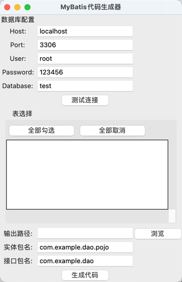

自定义代码生成器
# 一、扯淡
方便日常开发中新建表时能更快的生成mybatis的DAO、POJO、XML等文件。
我之前一直使用的mybatis-plus插件，但是最近转到使用idea的社区版了，mybatis-plus不让我装。
于是就寻思能不能一个生成mybatis代码的工具。
网上大量的贴子都是讲mybatis-generator集成到项目中，然后java项目启动时运行或者加一个maven插件。

我不想这样，我想要的是一个对项目代码无任何侵入的工具。找了一个半个多小时没有找到满意的项目和工具，于是打算自己写一个。

这个需求说白了就是一个代码生成器而已。
我只需要三步即可。
> 1、拿到数据库配置  
> 2、写好模板  
> 3、基于模板生成数据

因为我想要图形化界面，于是就让ai帮我生成了一下大致的代码，然后自己微调下就好了，花了两个多小时吧（emmm）
# 二、运行
## 2.1 运行环境
Python 3.8.12 
python3 小版本应该都可以
## 2.2 运行
```python
python3 mybatis_generator.py
```


# 三、打包
## 3.1 命令
如果你不想每次都打开ide，或者你想把这个工具发给其他没有代码的人，你可以选择将此工具打成包。

```shell
# liunx or macOs 打包
pyinstaller --windowed --icon=mybatis.ico --onefile --add-data="templates:templates" --name "自定义mybatis代码生成器" mybatis_generator.py

# windows
pyinstaller --windowed --icon=mybatis.ico --onefile --add-data="templates;templates" --name "自定义mybatis代码生成器" mybatis_generator.py
```

# 四、说明
## 4.1 可能存在的一些问题
1）模板太过简单  
目前并没生成SQL，仅BaseResultMap和baseColumns。如果有生成SQL需求的自己实现吧。  
2）依赖tk  
基础的增删查改功能，使用tk.mybatis的接口代理实现，如果不喜欢tk，偏向mybatis-plus也可自行修改模板。
```xml
<!-- mybatis的spring-starter，仅供参考-->
<dependency>
    <groupId>tk.mybatis</groupId>
    <artifactId>mapper-spring-boot-starter</artifactId>
    <version>2.1.5</version>
</dependency>
```
3）使用python，包可能比较大。  
上面说了其实需求仅需要拉到mysql表信息，然后按模板生成代码即可。可以用更轻的其他语言实现


